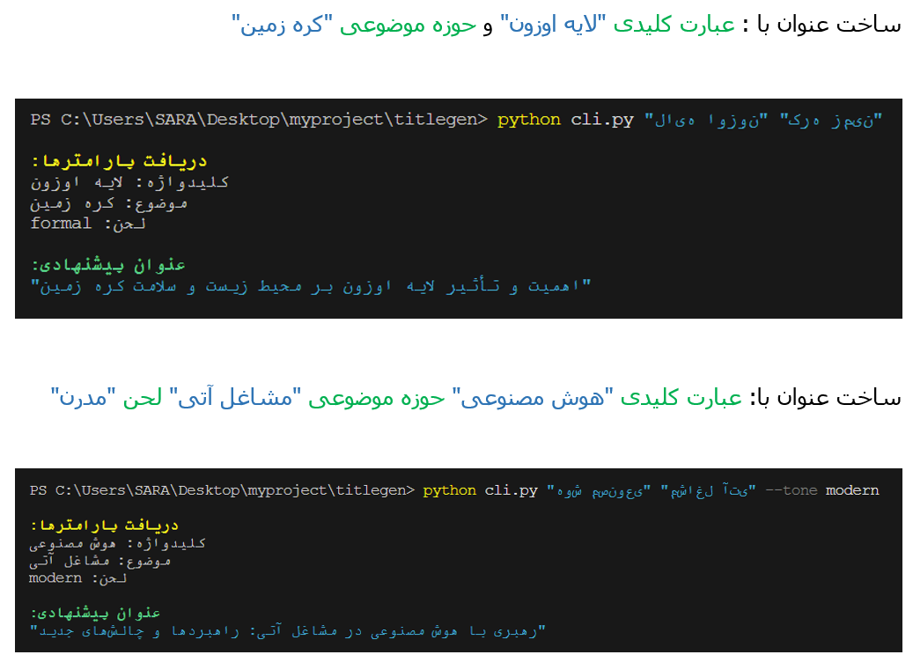

# Persian Title Generator

یک ابزار خط فرمان (CLI) برای تولید عنوان‌های حرفه‌ای فارسی با قابلیت سفارشی‌سازی و بهینه‌سازی برای سئو.

## نمونه خروجی



## ویژگی‌ها

- تولید عنوان‌های فارسی با طول حداقل ۵۰ کاراکتر
- پشتیبانی از حالات مختلف نگارشی (رسمی، غیررسمی، حرفه‌ای، دوستانه، مدرن)
- پردازش و نمایش صحیح متون فارسی در ترمینال
- اتصال به OpenAI از طریق OpenRouter API
- حالت آزمایشی برای تست بدون اتصال به API

## نصب و راه‌اندازی

### پیش‌نیازها

- Python 3.8 یا بالاتر
- pip (مدیریت پکیج‌های پایتون)

### نصب

1. کلون یا دانلود پروژه:
```
git clone https://github.com/stahan04/persian-title-generator-.git
cd persian-title-generator-
2.	نصب dependencies:

pip install -r requirements.txt
3.	تنظیم کلید API (اختیاری):

echo "OPENROUTER_API_KEY=your_api_key_here" > .env
دریافت کلید API
1.	به سایت OpenRouter مراجعه کنید
2.	حساب کاربری ایجاد کنید یا وارد شوید
3.	از بخش API Keys، یک کلید جدید ایجاد کنید
4.	کلید را در فایل .env قرار دهید
استفاده
دستور اصلی

python cli.py generate "کلیدواژه" "موضوع" [OPTIONS]
پارامترها
•	کلیدواژه: کلمه کلیدی اصلی برای عنوان (اجباری)
•	موضوع: حوزه موضوعی عنوان (اجباری)
گزینه‌ها
•	--tone, -t: تنظیم لحن عنوان (پیش‌فرض: formal)
o	مقادیر مجاز: formal, informal, professional, friendly, modern
•	--mock: استفاده از حالت آزمایشی (بدون اتصال به API)
مثال‌ها
تولید عنوان رسمی:

python cli.py generate "هوش مصنوعی" "تحلیل داده" --tone formal
تولید عنوان دوستانه:

python cli.py generate "بازی‌های ویدیویی" "سرگرمی" --tone friendly
استفاده از حالت آزمایشی:

python cli.py generate "بلاکچین" "امنیت سایبری" --mock
ساختار پروژه
persian-title-generator/
├── cli.py                 # فایل اصلی برنامه
├── requirements.txt       # dependencies پروژه
├── .gitignore            # فایل ignore گیت
├── README.md             # فایل راهنما
└── result1.png           # عکس نمونه از خروجی برنامه
توسعه
وابستگی‌ها
لیست کامل وابستگی‌ها در فایل requirements.txt موجود است:
•	typer: ساخت CLI
•	httpx: ارتباط با API
•	pydantic: validation داده‌ها
•	python-dotenv: مدیریت متغیرهای محیطی
•	rich: نمایش زیبای خروجی در ترمینال
•	arabic-reshaper و python-bidi: پردازش متون فارسی
اضافه کردن ویژگی جدید
1.	dependency جدید را به requirements.txt اضافه کنید
2.	از typer برای اضافه کردن دستورات جدید استفاده کنید
3.	مدل‌های داده را در کلاس TitleRequest گسترش دهید
4.	سرویس جدید را در کلاس OpenRouterService پیاده‌سازی کنید
پشتیبانی
اگر با مشکلی مواجه شدید یا سوالی دارید، لطفاً از طریق Issues گیت‌هاب مطرح کنید.
توجه
•	این ابزار از سرویس OpenRouter استفاده می‌کند که نیاز به API Key دارد
•	مطمئن شوید کلید API خود را در فایل .env ذخیره کرده‌اید
•	از به اشتراک گذاشتن کلید API خود خودداری کنید

